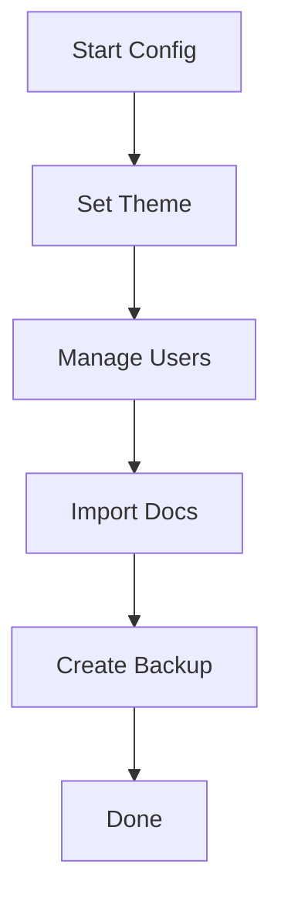

## Overview

Janek Unon lets you tailor your documentation space with custom themes, user permissions, import tools, and backup features. Start by accessing the settings panel from your dashboard sidebar. This guide walks you through each configuration step to match your project's branding and workflow.

<Columns cols={3}>
  <Card title="Themes & Branding" icon="palette" href="#themes">
    Apply custom colors and logos.
  </Card>
  <Card title="User Access" icon="users" href="#access">
    Manage team permissions.
  </Card>
  <Card title="Import & Backup" icon="database" href="#import-backup">
    Migrate content securely.
  </Card>
</Columns>

## Setting Up Themes and Branding

Customize your space's appearance to reflect your brand. Navigate to `Settings > Appearance` in the dashboard.

<Steps>
  <Step title="Choose a Theme" icon="palette">
    Select from predefined themes or create a custom one.

    <CodeGroup tabs="JSON,Env">
    ````json
    {
      "primaryColor": "#3B82F6",
      "logoUrl": "https://your-domain.com/logo.svg",
      "fontFamily": "Inter, sans-serif"
    }
    ````

    ````bash
    JANECK_PRIMARY_COLOR=#3B82F6
    JANECK_LOGO_URL=https://your-domain.com/logo.svg
    ````
    </CodeGroup>
  </Step>
  <Step title="Preview Changes" icon="eye">
    Use the live preview to test your theme before saving.
  </Step>
  <Step title="Apply Globally" icon="check-circle">
    Click `Apply to All Pages` to update your entire space.
  </Step>
</Steps>

<Callout kind="tip">
  Use hex colors like `#3B82F6` for your brand. Test on dark and light modes.
</Callout>

## Configuring User Access

Control who can view, edit, or admin your docs. Go to `Settings > Users & Permissions`.

<Tabs>
  <Tab title="Role-Based Access" icon="shield">
    Assign roles via the user table.

    | Role       | View | Edit | Admin |
    |------------|------|------|-------|
    | Viewer     | ✅   | ❌   | ❌    |
    | Editor     | ✅   | ✅   | ❌    |
    | Admin      | ✅   | ✅   | ✅    |
  </Tab>
  <Tab title="Invite Users" icon="user-plus">
    Send invites with custom permissions.

    ````javascript
    await janek.inviteUser({
      email: "team@yourcompany.com",
      role: "editor",
      permissions: ["edit-pages", "manage-comments"]
    });
    ````
  </Tab>
</Tabs>

## Importing Existing Documentation

Migrate content from other platforms seamlessly. Visit `Settings > Import`.

<ExpandableGroup>
  <Expandable title="From Markdown Files" default-open="true">
    Upload ZIP archives or connect Git repos.

    ````bash
    janek import --source ./docs-folder --format md --target /imported-docs
    ````
  </Expandable>
  <Expandable title="From Notion or Confluence">
    Use API keys for direct sync.

    Set `NOTION_API_KEY=your-notion-key-here` in your env vars.
  </Expandable>
</ExpandableGroup>

## Backup and Export Options

Protect your content with regular backups. Access via `Settings > Backup`.

<Callout kind="warning">
  Enable automated backups to avoid data loss during migrations.
</Callout>

<CodeGroup tabs="CLI,API">
````bash
janek backup create --format zip --output ./backups/janek-backup-2024-10-15.zip
````

````javascript
const backup = await janek.backups.create({
  format: "zip",
  includeAttachments: true,
  ttlDays: 30
});
console.log(`Backup ID: ${backup.id}`);
````
</CodeGroup>

Export full spaces as MDX bundles for GitHub or static hosting.



Your space now matches your project's needs. Review changes in the preview mode before going live.